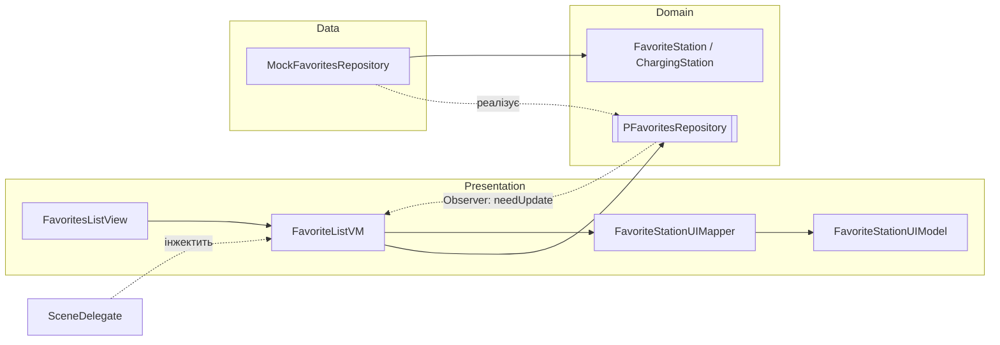

# Архітектура — Zaryad

Документ описує архітектуру застосунку, розподіл відповідальності між компонентами та застосовані патерни проєктування. Спирається на практичну роботу №1.

## Обрана архітектура: MVVM + багатошаровість (Clean-lite)

**Чому MVVM.** Проєкт — нативний iOS-клієнт без власного бекенду, невеликого/середнього обсягу. MVVM дає чіткий розподіл «представлення ↔ логіка», добре поєднується з реактивним оновленням UI (`ObservableObject`/`@Published`) і легко тестується. MVC на такому обсязі призвів би до «важких» контролерів, а VIPER — надлишкова церемонія (зайві модулі та протоколи на кожен екран).

**Шари:**
- **Presentation** — `View` + `ViewModel` (+ `Mapper` у UI-моделі).
- **Domain** — сутності та **протоколи** репозиторіїв (чисто, без залежностей від фреймворків).
- **Data** — реалізації репозиторіїв (наразі мок, згодом Firebase).

**Обмеження підходу:** MVVM не описує навігацію — її винесемо в **Coordinator** (наступний етап). Без цього логіка переходів могла б осісти у View/VM.

## Схема компонентів (сценарій «Обране»)



**Напрямки взаємодії:** `View` тримає `VM` і показує його `state`; `VM` звертається до даних лише через **протокол** `PFavoritesRepository`; конкретну реалізацію (`MockFavoritesRepository`) інжектить `SceneDelegate`; доменні `FavoriteStation` перетворюються на `FavoriteStationUIModel` через `Mapper`; про зовнішні зміни даних репозиторій сповіщає VM через **Observer** (`observeEvents` / `FavoritesStationEvent.needUpdate`).

## Взаємодія у сценарії (крок за кроком)
1. Користувач діє у `FavoritesListView` (тап/видалення/додавання).
2. `View` викликає метод `FavoriteListVM`.
3. `VM` звертається до `PFavoritesRepository` (`loadFavorites` / `createFavorite` / `removeFavorite`).
4. `MockFavoritesRepository` виконує операцію над колекцією та (для create) емітить `needUpdate`.
5. `VM` мапить результат через `FavoriteStationUIMapper` і оновлює `state` (`loading/empty/error/list`).
6. `View` реактивно перемальовується за новим `state`.

## Патерни проєктування (три категорії)

| Категорія | Патерн | Компонент | Задача · Учасники · Місце |
|---|---|---|---|
| **Поведінковий** | Observer | `PFavoritesRepository.observeEvents`, `FavoritesStationEvent` | **Задача:** сповіщати VM про зовнішні зміни даних. **Учасники:** видавець — репозиторій, підписник — VM. **Місце:** `subscribeToEvents()` у `FavoriteListVM`. |
| **Структурний** | Adapter | `FavoriteStationUIMapper` | **Задача:** привести доменну `FavoriteStation` до формату UI. **Учасники:** адаптований тип — домен, цільовий — `FavoriteStationUIModel`, адаптер — мапер. **Місце:** `apply(result:)` у VM. |
| **Породжувальний** | Factory Method | `MockFavoritesRepository.station(...)`, демо-фабрика | **Задача:** інкапсулювати складне створення `ChargingStation` з вкладених типів. **Учасники:** фабричний метод + продукт `ChargingStation`. **Місце:** мокові дані / демо-додавання. |

> Породжувальний патерн буде посилено **Assembler/DIContainer** із появою координатора (наступний етап) — це «composition root», що збирає граф залежностей.

Додатково фактично використано **MVVM-біндинг** (`ObservableObject`/`@Published`) — різновид Observer між VM і View.

## Принципи SOLID (стисло)

| Принцип | Як реалізовано |
|---|---|
| **S** — Single Responsibility | `VM` — стан/логіка; `Mapper` — перетворення; `Repository` — доступ до даних; `View` — рендер. Кожен має одну причину для змін. |
| **O** — Open/Closed | Нове джерело даних = новий клас `…: PFavoritesRepository`, без змін у `FavoriteListVM`. |
| **L** — Liskov | `MockFavoritesRepository` і майбутній `FirebaseFavoritesRepository` взаємозамінні для VM. |
| **I** — Interface Segregation | Вузькі протоколи: `PFavoritesRepository` (лише обране), `PFavoriteListVM` (лише потрібне в'юсі). |
| **D** — Dependency Inversion | `VM` залежить від протоколу, не від конкретики; реалізацію інжектить `SceneDelegate` через `init(repo:)`. |

**DI vs DIP:** DIP — *принцип* «залеж від абстракцій» (протокол `PFavoritesRepository`); DI — *техніка* «передай залежність ззовні» (`FavoriteListVM(repo:)`). У коді присутні обидва.

## Заміна залежності (тестова/демо)
`FavoriteListVM` не знає про конкретний репозиторій. Щоб замінити джерело — достатньо передати іншу реалізацію протоколу:
```swift
// демо / поточний стан
FavoriteListVM(repo: MockFavoritesRepository())
// продакшн (згодом)
FavoriteListVM(repo: FirebaseFavoritesRepository())
// тест
FavoriteListVM(repo: StubFavoritesRepository())
```
Жоден рядок у самому `VM` при цьому не змінюється — це і є перевірка коректності DIP/DI.

## Антипатерни (чого уникнули)
- **Надмірна відповідальність (God-object):** логіку розділено на `VM` / `Repository` / `Mapper` / `View`, а не звалено в один контролер.
- **Пряме поєднання UI з доступом до даних:** між ними стоять протокол репозиторію та мапер; `View` не знає про джерело даних.
- **Приховані глобальні залежності:** немає синглтонів — залежності передаються через `init` (DI).
- **Дублювання:** перетворення домен→UI зосереджено в одному `Mapper`; ідентичність рядків забезпечує унікальний `id: UUID`.
